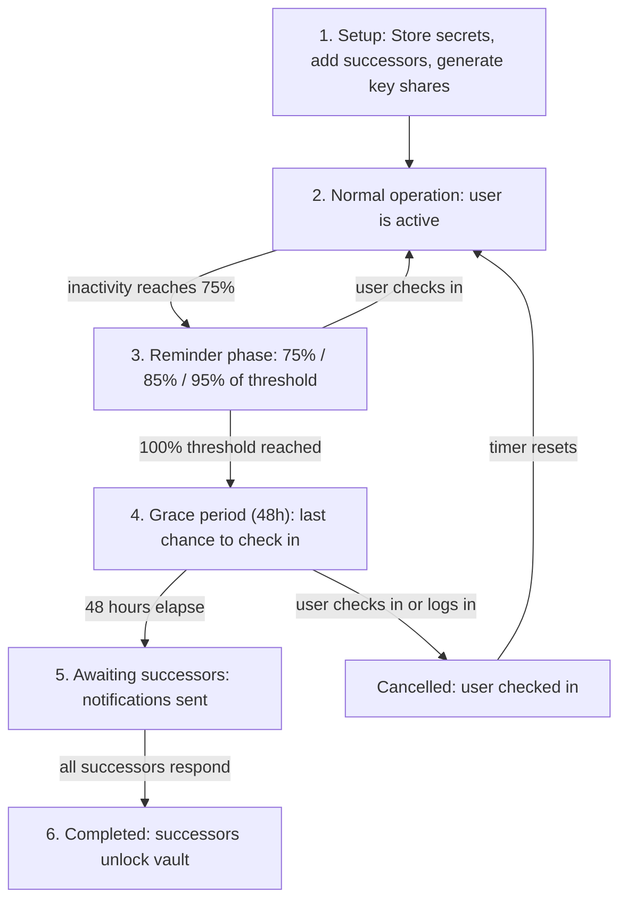
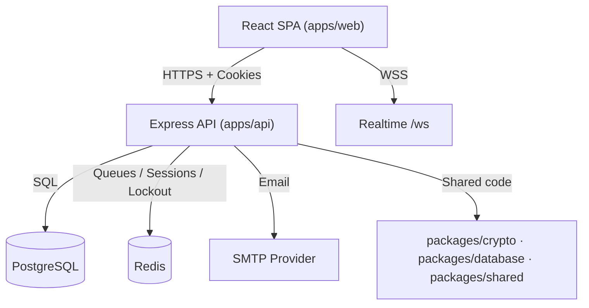

<div align="center">

# HandoverKey

Your passwords and secrets, quietly handed over — only if you go silent.

[](https://github.com/HandoverKey/HandoverKey/actions/workflows/ci.yml)
[](https://opensource.org/licenses/MIT)
[](https://github.com/HandoverKey/HandoverKey/releases)
[](https://nodejs.org/)
[](https://www.typescriptlang.org/)
[](http://makeapullrequest.com)
[](SECURITY.md)

**[Live app](https://handoverkey.app)** &nbsp;•&nbsp; [Features](#key-features) &nbsp;•&nbsp; [How It Works](#how-it-works) &nbsp;•&nbsp; [Quick Start](#quick-start) &nbsp;•&nbsp; [Architecture](#architecture) &nbsp;•&nbsp; [Docs](#documentation) &nbsp;•&nbsp; [Contributing](#contributing)

</div>

---

## About

HandoverKey is a self-hostable, open-source **digital legacy platform** — a zero-knowledge encrypted vault with a built-in dead man's switch.

You store secrets. You pick successors. If you go quiet long enough, the vault hands itself over to the people you chose — and to no one else. Every secret is encrypted in your browser before it touches the server. We never see plaintext.

1. **Store** — add passwords, seed phrases, documents, and notes to your vault. Encrypted client-side with AES-256-GCM before leaving your device.
2. **Set the timer** — choose an inactivity window (30–365 days). Every login resets it. You get email reminders as it runs down.
3. **Hand over** — if the timer expires, verified successors each receive a cryptographic key share. Only a quorum of them together can reconstruct the master key and decrypt the vault.

## Project Status

`v1.4.3` is the current release. <!-- x-release-please-version -->

HandoverKey is beyond a prototype but is **not yet a hardened, audited production service** — treat it as an advanced beta and review the [security docs](docs/security.md) before trusting it with irreplaceable secrets. The current build includes:

- Client-side encrypted vault with AES-256-GCM and PBKDF2 key derivation
- TOTP 2FA with recovery codes and password strength enforcement
- Secure session management with httpOnly cookies
- Activity logs and secure one-click check-in links
- Vault import/export
- Successor verification, per-entry access restrictions, and key share generation
- Handover orchestration with a full state machine (grace period → awaiting → complete/cancelled)
- Guided onboarding checklist for new users
- Realtime WebSocket notifications
- Role-based admin dashboard and operational APIs
- Stripe billing (optional, operator-configured)

Roadmap: mobile clients, passkeys/WebAuthn, broader multi-language support.

## Plans & the Dead Man's Switch

The automated handover uses Shamir's Secret Sharing, which **requires at least two successors**. The Free tier stores one successor for record-keeping; paid plans unlock the multi-successor automated handover.

| Plan   | Vault entries | Successors | Automated Shamir handover           |
| ------ | ------------- | ---------- | ----------------------------------- |
| Free   | up to 5       | 1          | Not available (needs 2+ successors) |
| Pro    | Unlimited     | up to 5    | Available                           |
| Family | Unlimited     | Unlimited  | Available                           |

## Key Features

- **Zero-knowledge vault** — secrets are encrypted client-side with AES-256-GCM before they are sent to the API. The server stores only ciphertext.
- **Dead man's switch** — configurable inactivity thresholds (30–365 days), graduated reminders at 75/85/95%, a 48-hour grace period, and manual/email check-in flows.
- **Shamir's Secret Sharing** — the master key is split into N shares with a K-of-N threshold. Any K successors can reconstruct it; fewer than K reveals nothing.
- **Successor controls** — verified successors, configurable quorum threshold, and optional per-entry access restrictions so each successor sees only what you assign them.
- **Strong account security** — httpOnly cookie auth, server-side session validation, TOTP 2FA, recovery codes, password strength enforcement, brute-force login throttling, and Zod-validated request schemas.
- **Realtime UX** — WebSocket notifications for reminders and handover state changes.
- **Portable data** — encrypted vault export/import for backup and self-hosting migration.
- **Operational visibility** — role-gated admin dashboard, HMAC-signed activity logs, health checks, and structured Pino logging.

## How It Works

### The Handover Lifecycle



**Step 1 — Setup.** Create an account, add secrets to the vault (encrypted client-side), designate successors, generate key shares, and configure an inactivity threshold (30–365 days, default 90).

**Step 2 — Normal operation.** Logins and authenticated actions reset the inactivity timestamp. A background monitor checks thresholds every 15 minutes, with an hourly BullMQ job as a backstop.

**Step 3 — Reminder phase.** As inactivity approaches the threshold, graduated email reminders are sent. Each includes a secure one-click check-in link (valid 7 days):

| Threshold reached | Reminder        | Cooldown |
| ----------------- | --------------- | -------- |
| 75%               | First reminder  | 24 hours |
| 85%               | Second reminder | 12 hours |
| 95%               | Final warning   | 6 hours  |

**Step 4 — Grace period.** At 100% inactivity, a 48-hour grace period begins. Logging in, clicking a check-in link, or manually checking in cancels everything. Successors are not notified yet.

**Step 5 — Awaiting successors.** After the grace period, each successor receives an email with a unique access link and can accept or decline.

**Step 6 — Vault unlock.** An accepted successor visits their link, enters their key share plus shares collected from co-successors, and the browser reconstructs the master key client-side via Shamir's Secret Sharing. The server never sees plaintext.

### Shamir's Secret Sharing — Key Splits

| Setting               | Threshold (K)      | Example with 4 successors |
| --------------------- | ------------------ | ------------------------- |
| `requireMajority` off | `min(2, N)`        | 2-of-4                    |
| `requireMajority` on  | `floor(N / 2) + 1` | 3-of-4                    |

**2-of-3 (family setup):** any two of three can unlock — one can be unreachable.

```text
Master Key → split into 3 shares (threshold = 2)
  Share 1 → Successor A (spouse)
  Share 2 → Successor B (sibling)
  Share 3 → Successor C (attorney)
Unlock: any 2 combine shares → master key → decrypt vault
```

**3-of-5 (small team):** majority required — survives two absent successors.

**2-of-2 (strict pair):** both must cooperate — if either is unreachable, the vault stays sealed.

### Conflict Resolution

- **Successor declines** — counts as a response; the handover completes once all successors have responded (accept or decline).
- **Not enough shares** — if accepted successors hold fewer than K shares, the key cannot be reconstructed. The vault stays sealed by design.
- **User returns during grace period** — logging in, a check-in link, or a manual check-in cancels the handover. Successors are never notified.
- **User returns after successors are notified** — `POST /api/v1/handover/cancel` is still available. Notified successors receive a cancellation email.
- **User pauses the switch** — the tracker can be paused indefinitely or until a date from the settings page.

## Architecture

HandoverKey is a Turbo monorepo with two deployable apps and three shared packages.



```text
apps/
  api/       Express 5 API — controllers, services, jobs, validation, handover orchestration
  web/       React 19 SPA — pages, components, contexts, encryption service
packages/
  crypto/    AES-256-GCM, PBKDF2, Shamir's Secret Sharing (Web Crypto API)
  database/  Kysely client, repository layer, schema types
  shared/    Cross-package types, constants, validation utilities
docs/
  API contract, architecture, deployment, security, testing
```

See [`docs/architecture.md`](docs/architecture.md) for the detailed runtime model.

## Quick Start

### Prerequisites

- Node.js 22+
- npm 9+
- Docker (for PostgreSQL and Redis)

### Local setup

```bash
git clone https://github.com/HandoverKey/HandoverKey.git
cd HandoverKey
npm install

cp apps/api/.env.example apps/api/.env
cp apps/web/.env.example apps/web/.env

# Fill in JWT_SECRET and ACTIVITY_HMAC_SECRET in apps/api/.env:
# openssl rand -base64 64

npm run docker:up
npm run db:migrate
npm run dev
```

| URL     | Default                        |
| ------- | ------------------------------ |
| Web app | `http://localhost:5173`        |
| API     | `http://localhost:3001/api/v1` |

## Testing

```bash
npm run lint
npm run test
npm run build
```

| Workspace           | Tooling                                                  |
| ------------------- | -------------------------------------------------------- |
| `apps/api`          | Jest — integration tests against real PostgreSQL + Redis |
| `apps/web`          | Vitest + Testing Library                                 |
| `packages/crypto`   | Jest — 80% coverage threshold enforced                   |
| `packages/database` | Jest                                                     |
| `packages/shared`   | Jest                                                     |

Pre-commit hooks run Prettier and ESLint on staged files via Husky + lint-staged.

## Documentation

| Doc                                                  | Contents                                         |
| ---------------------------------------------------- | ------------------------------------------------ |
| [docs.handoverkey.app](https://docs.handoverkey.app) | Full documentation site                          |
| [`docs/api.md`](docs/api.md)                         | API contract and auth model                      |
| [`docs/architecture.md`](docs/architecture.md)       | Runtime topology and package boundaries          |
| [`docs/security.md`](docs/security.md)               | Implemented security model and known limitations |
| [`docs/deployment.md`](docs/deployment.md)           | Local, container, and hosted deployment          |
| [`docs/testing.md`](docs/testing.md)                 | Test workflows and coverage expectations         |
| [`CONTRIBUTING.md`](CONTRIBUTING.md)                 | Contribution workflow and quality bar            |

## Security

Report vulnerabilities privately — not through public GitHub issues.

See [`SECURITY.md`](SECURITY.md) and email `security@handoverkey.app`.

## Contributing

Bug fixes, docs updates, tests, and new features are all welcome.

1. Branch from `main`.
2. Add or update tests for behavior changes.
3. Update docs if the API, UI, or deployment contract changed.
4. Run `npm run lint && npm run test && npm run build` before opening a PR.

## Troubleshooting

| Problem                                | Fix                                                                 |
| -------------------------------------- | ------------------------------------------------------------------- |
| Docker services fail to start          | Check Docker Desktop status and rerun `npm run docker:up`           |
| API fails during startup               | Verify `JWT_SECRET`, `ACTIVITY_HMAC_SECRET`, DB, and Redis env vars |
| Web app cannot reach API in production | Set `VITE_API_URL` and `VITE_WS_URL` explicitly                     |
| SPA routes 404 on hosted deployment    | Ensure rewrite rules are configured (see `apps/web/vercel.json`)    |

## Roadmap

- Mobile applications
- Passkeys / WebAuthn
- Multi-language support
- Additional operator tooling and deployment automation

## License

MIT — see [`LICENSE`](LICENSE).
