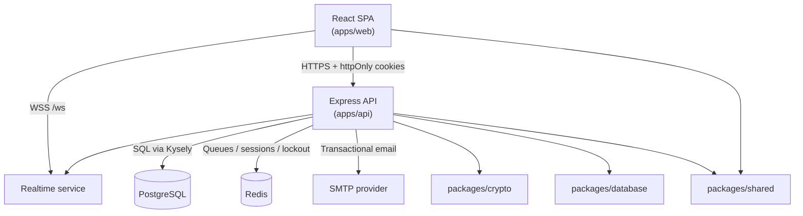
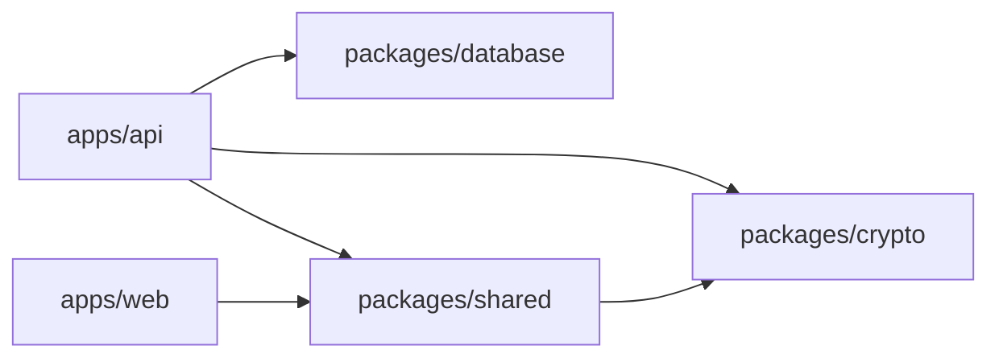
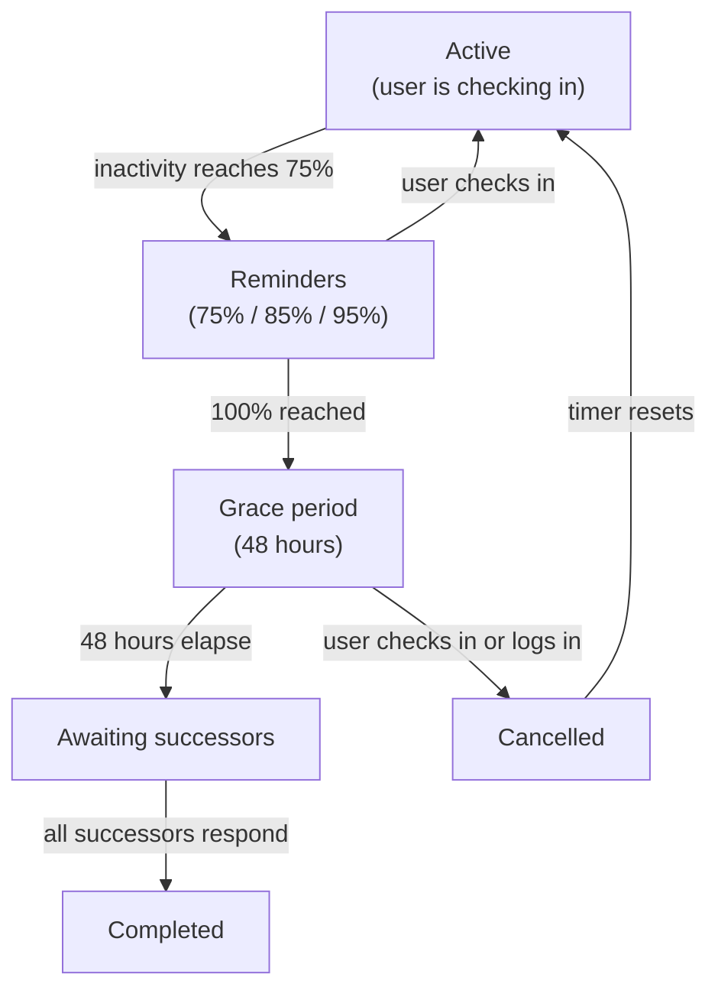

## Overview

HandoverKey is a **Turbo monorepo** with two deployable apps and three shared packages.

```
apps/
  api/       Express 5 REST API
  web/       React 19 SPA
  docs/      Starlight docs site (this site)
packages/
  crypto/    AES-256-GCM, PBKDF2, Shamir's Secret Sharing
  database/  Kysely client, repository layer, schema types
  shared/    Cross-package types, constants, validation utilities
```

## Runtime topology



## Package dependency direction



Circular dependencies are intentionally avoided.

## Core data flows

### Encrypted vault

1. The browser derives a master key from the user's password via PBKDF2 (100,000 iterations, SHA-256).
2. Each vault entry is encrypted with AES-256-GCM entirely in the browser before being sent.
3. The API stores encrypted blobs, IVs, salts, and metadata — never plaintext.
4. On read, the browser decrypts locally with the in-memory master key.

### Authentication

1. Browser derives an auth key from password + email via PBKDF2 — the raw password never leaves the device.
2. Server stores bcrypt hash of the auth key (rounds = 12).
3. Login sets `accessToken` (1h) and `refreshToken` (7d) as httpOnly cookies.
4. Every protected route validates both the JWT and the backing server-side session record.
5. Optional TOTP 2FA adds a second factor.

### Inactivity and handover state machine



### Shamir's Secret Sharing

The master encryption key is split into N shares with threshold K. Any K shares reconstruct the key; fewer than K reveals nothing.

| `requireMajority` | Threshold K |
| --- | --- |
| off | `min(2, N)` |
| on  | `floor(N / 2) + 1` |

Reconstruction happens entirely in the successor's browser — the server never handles plaintext.

## Persistence

### PostgreSQL

Stores: users, sessions, vault entries, successors, inactivity settings, activity logs, notification deliveries, handover processes.

### Redis

Used for: BullMQ job queues, login throttle counters, low-latency operational state.

## Observability

| Endpoint | Output |
| --- | --- |
| `GET /health` | JSON: DB, Redis, queues, realtime status |
| `GET /metrics` | Prometheus-compatible metrics |

Structured logging via **Pino** throughout the API. Activity records are HMAC-signed for integrity.
